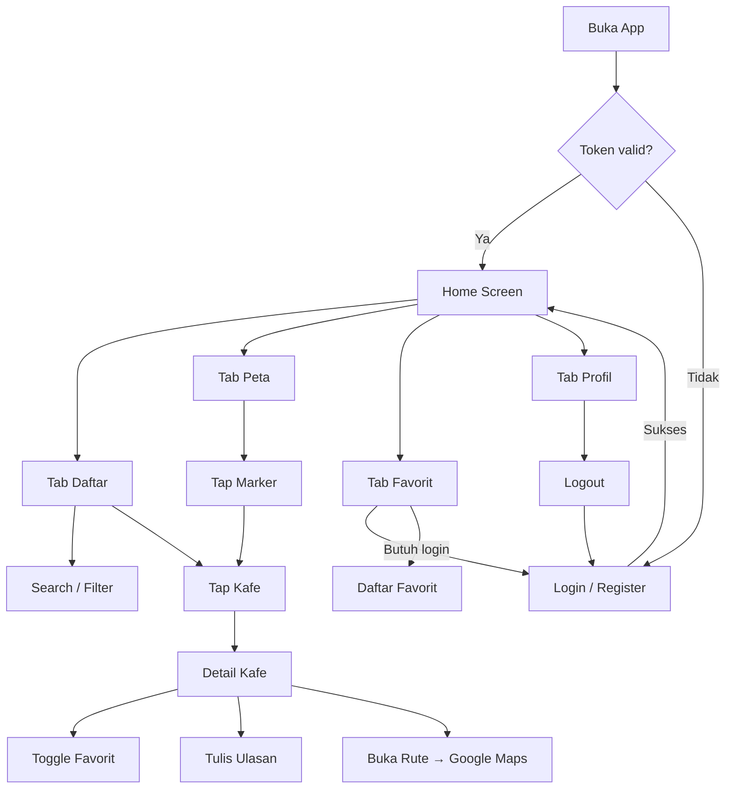

# Rencana Pengembangan — Café Finder (Flutter)

**Versi:** 1.0  
**Tanggal:** 2 Juni 2026  
**Berdasarkan:** [Cafe Finder PRD.md](./Cafe%20Finder%20PRD.md)  
**Platform target:** Android (MVP), arsitektur siap ekspansi ke iOS

---

## Daftar Isi

1. [Ringkasan Eksekutif](#1-ringkasan-eksekutif)
2. [Stack Teknologi](#2-stack-teknologi)
3. [Arsitektur Aplikasi](#3-arsitektur-aplikasi)
4. [Struktur Proyek](#4-struktur-proyek)
5. [Model Data & API Layer](#5-model-data--api-layer)
6. [Spesifikasi Layar](#6-spesifikasi-layar)
7. [Alur Navigasi & Routing](#7-alur-navigasi--routing)
8. [State Management](#8-state-management)
9. [Fitur Inti — Detail Implementasi](#9-fitur-inti--detail-implementasi)
10. [Keamanan & Penyimpanan Lokal](#10-keamanan--penyimpanan-lokal)
11. [GPS, Peta & Routing](#11-gps-peta--routing)
12. [Error Handling & UX States](#12-error-handling--ux-states)
13. [Design System & UI/UX](#13-design-system--uiux)
14. [Testing Strategy](#14-testing-strategy)
15. [Konfigurasi Build & Environment](#15-konfigurasi-build--environment)
16. [Fase Pengembangan & Timeline](#16-fase-pengembangan--timeline)
17. [Definition of Done](#17-definition-of-done)
18. [Risiko & Mitigasi](#18-risiko--mitigasi)
19. [Out of Scope (MVP)](#19-out-of-scope-mvp)
20. [Referensi API](#20-referensi-api)

---

## 1. Ringkasan Eksekutif

Café Finder adalah aplikasi direktori kafe berbasis peta untuk mahasiswa di sekitar kampus. Aplikasi Flutter ini akan:

- Menampilkan daftar dan peta kafe dari Cloud REST API
- Mendukung pencarian, filter kategori, dan paginasi
- Menyediakan detail kafe lengkap dengan ulasan dan favorit
- Mengintegrasikan autentikasi JWT (register, login, logout)
- Membuka rute navigasi via Google Maps intent
- Menghitung jarak user → kafe menggunakan GPS dan formula Haversine

**Prinsip pengembangan:**
- Clean Architecture dengan pemisahan layer yang jelas
- Feature-first folder structure agar mudah diskalakan
- Offline-friendly untuk data referensi (kategori & tag)
- Semua kredensial sensitif di environment config, bukan hardcoded di APK

---

## 2. Stack Teknologi

| Kategori | Paket / Teknologi | Alasan |
|----------|-------------------|--------|
| **Framework** | Flutter 3.x (Dart 3.x) | Cross-platform, performa native-like |
| **State Management** | `flutter_bloc` + `equatable` | Predictable state, testable, cocok untuk auth & pagination |
| **Networking** | `dio` + `retrofit` (opsional) | Interceptor untuk JWT refresh, timeout, logging |
| **Routing** | `go_router` | Deep link, redirect berdasarkan auth state |
| **Secure Storage** | `flutter_secure_storage` | Simpan access & refresh token secara aman |
| **Local Cache** | `shared_preferences` + `hive` (opsional) | Cache kategori/tag session |
| **Maps** | `google_maps_flutter` | Marker kafe, tap → detail |
| **Location** | `geolocator` + `permission_handler` | GPS user, izin lokasi |
| **URL Launcher** | `url_launcher` | Buka Google Maps untuk routing |
| **Image Loading** | `cached_network_image` | Foto kafe dengan cache |
| **Form Validation** | built-in + custom validators | Email, password, rating |
| **Dependency Injection** | `get_it` + `injectable` (opsional) | Service locator untuk repository |
| **Code Generation** | `freezed` + `json_serializable` | Immutable models, JSON parsing |
| **Testing** | `flutter_test`, `mocktail`, `bloc_test` | Unit & widget test |

---

## 3. Arsitektur Aplikasi

Menggunakan **Clean Architecture** dengan 3 layer utama:

```
┌─────────────────────────────────────────────────────────┐
│                    Presentation Layer                    │
│  (Screens, Widgets, BLoC/Cubit, GoRouter)               │
└────────────────────────┬────────────────────────────────┘
                         │
┌────────────────────────▼────────────────────────────────┐
│                     Domain Layer                       │
│  (Entities, Use Cases, Repository Interfaces)           │
└────────────────────────┬────────────────────────────────┘
                         │
┌────────────────────────▼────────────────────────────────┐
│                      Data Layer                        │
│  (Models, Data Sources, Repository Implementations)     │
└─────────────────────────────────────────────────────────┘
```

### Alur Data (contoh: daftar kafe)

```
UI (HomeScreen)
  → PlacesBloc.add(LoadPlaces)
    → GetPlacesUseCase
      → PlacesRepository
        → PlacesRemoteDataSource (Dio GET /places)
          → PlaceModel.fromJson → Place Entity
            → PlacesLoaded state → UI rebuild
```

### Prinsip Dependency Rule

- Presentation hanya bergantung pada Domain
- Data mengimplementasikan interface dari Domain
- Domain tidak bergantung pada Flutter atau package eksternal

---

## 4. Struktur Proyek

```
lib/
├── main.dart
├── app.dart                          # MaterialApp, theme, router
├── core/
│   ├── config/
│   │   ├── env.dart                  # BASE_URL dari --dart-define
│   │   └── app_constants.dart
│   ├── di/
│   │   └── injection.dart            # get_it setup
│   ├── error/
│   │   ├── exceptions.dart
│   │   └── failures.dart
│   ├── network/
│   │   ├── dio_client.dart
│   │   ├── auth_interceptor.dart     # attach Bearer token
│   │   └── api_response.dart         # wrapper { success, data, meta }
│   ├── router/
│   │   ├── app_router.dart
│   │   └── route_names.dart
│   ├── storage/
│   │   └── secure_storage_service.dart
│   ├── utils/
│   │   ├── haversine.dart            # hitung jarak km
│   │   ├── opening_hours_formatter.dart
│   │   └── debouncer.dart            # search debounce
│   └── widgets/
│       ├── app_error_widget.dart
│       ├── app_loading.dart
│       ├── empty_state.dart
│       └── rating_stars.dart
│
├── features/
│   ├── auth/
│   │   ├── data/
│   │   │   ├── datasources/auth_remote_datasource.dart
│   │   │   ├── models/user_model.dart
│   │   │   └── repositories/auth_repository_impl.dart
│   │   ├── domain/
│   │   │   ├── entities/user.dart
│   │   │   ├── repositories/auth_repository.dart
│   │   │   └── usecases/
│   │   │       ├── login.dart
│   │   │       ├── register.dart
│   │   │       ├── logout.dart
│   │   │       └── get_current_user.dart
│   │   └── presentation/
│   │       ├── bloc/auth_bloc.dart
│   │       ├── pages/
│   │       │   ├── login_page.dart
│   │       │   └── register_page.dart
│   │       └── widgets/
│   │
│   ├── places/
│   │   ├── data/
│   │   ├── domain/
│   │   └── presentation/
│   │       ├── bloc/
│   │       │   ├── places_list_bloc.dart
│   │       │   └── place_detail_bloc.dart
│   │       ├── pages/
│   │       │   ├── home_page.dart          # tab container
│   │       │   ├── places_list_tab.dart
│   │       │   ├── map_tab.dart
│   │       │   ├── place_detail_page.dart
│   │       │   └── submit_place_page.dart  # opsional MVP
│   │       └── widgets/
│   │           ├── place_card.dart
│   │           ├── place_filter_bar.dart
│   │           └── photo_carousel.dart
│   │
│   ├── categories/
│   │   └── ...                           # fetch & cache kategori
│   │
│   ├── reviews/
│   │   └── ...                           # CRUD ulasan
│   │
│   ├── favorites/
│   │   └── ...                           # toggle & daftar favorit
│   │
│   ├── profile/
│   │   └── presentation/pages/profile_page.dart
│   │
│   └── splash/
│       └── presentation/pages/splash_page.dart
│
test/
├── unit/
├── widget/
└── integration/
```

---

## 5. Model Data & API Layer

### 5.1 Base Response Wrapper

Semua endpoint mengembalikan format standar:

```dart
class ApiResponse<T> {
  final bool success;
  final String message;
  final T? data;
  final PaginationMeta? meta;
}
```

### 5.2 Entity & Model Mapping

| Entity (Domain) | Model (Data) | Sumber API |
|-----------------|--------------|------------|
| `User` | `UserModel` | `/auth/me`, login response |
| `Place` (list) | `PlaceListItemModel` | `GET /places` |
| `PlaceDetail` | `PlaceDetailModel` | `GET /places/:id` |
| `Category` | `CategoryModel` | `GET /categories` |
| `Tag` | `TagModel` | `GET /tags` |
| `Review` | `ReviewModel` | nested di place detail |
| `Favorite` | `FavoriteModel` | `GET /favorites` |

### 5.3 Endpoint Registry

| Modul | Method | Path | Auth |
|-------|--------|------|------|
| Register | POST | `/api/v1/auth/register` | ❌ |
| Login | POST | `/api/v1/auth/login` | ❌ |
| Me | GET | `/api/v1/auth/me` | ✅ |
| Logout | POST | `/api/v1/auth/logout` | ✅ |
| Places List | GET | `/api/v1/places` | ❌ |
| Place Detail | GET | `/api/v1/places/:id` | ❌ |
| Submit Place | POST | `/api/v1/places` | ✅ |
| Categories | GET | `/api/v1/categories` | ❌ |
| Tags | GET | `/api/v1/tags` | ❌ |
| Add Review | POST | `/api/v1/places/:id/reviews` | ✅ |
| Update Review | PUT | `/api/v1/reviews/:id` | ✅ |
| Delete Review | DELETE | `/api/v1/reviews/:id` | ✅ |
| Toggle Favorite | POST | `/api/v1/favorites/places/:id/favorite` | ✅ |
| Get Favorites | GET | `/api/v1/favorites` | ✅ |

### 5.4 Auth Interceptor Flow

```
Request keluar
  ├── Cek apakah endpoint butuh token
  ├── Attach Authorization: Bearer <access_token>
  └── Jika 401 Unauthorized:
        ├── Coba refresh token (jika endpoint tersedia di backend)
        ├── Jika refresh gagal → clear storage → redirect ke Login
        └── Jika refresh sukses → retry request original
```

> **Catatan:** PRD menyebut access token 15 menit & refresh token 7 hari. Jika backend belum expose endpoint `/auth/refresh`, implementasi awal: deteksi 401 → logout otomatis + pesan "Sesi berakhir, silakan login kembali".

### 5.5 Query Builder — Places List

```dart
class PlacesQueryParams {
  final String? search;
  final int? category;
  final String? district;
  final String sort;       // 'rating' | 'latest'
  final String order;      // 'asc' | 'desc'
  final int page;
  final int limit;
}
```

---

## 6. Spesifikasi Layar

### 6.1 Splash Screen

| Aspek | Detail |
|-------|--------|
| **Fungsi** | Cek token tersimpan, validasi sesi |
| **Logic** | Token ada → fetch `/auth/me` → Home; tidak ada / invalid → Login |
| **Durasi** | Minimal 1.5 detik untuk branding |
| **Widget** | Logo app, loading indicator |

### 6.2 Login & Register

| Aspek | Login | Register |
|-------|-------|----------|
| **Fields** | email, password | name, email, password |
| **Validasi** | email format, password tidak kosong | name min 2 char, password min 6 char |
| **Aksi sukses** | Simpan token → redirect Home | Simpan token → redirect Home |
| **Navigasi** | Link ke Register | Link ke Login |

### 6.3 Home — Tab Daftar Kafe

| Komponen | Implementasi |
|----------|--------------|
| **Search bar** | Debounce 400ms → `search` query param |
| **Filter kategori** | Horizontal chip list dari `GET /categories` |
| **Sort toggle** | Rating / Terbaru |
| **List kafe** | `ListView.builder` + infinite scroll |
| **Place card** | Foto thumbnail, nama, alamat, rating ⭐, jarak (km) |
| **Pagination** | Load more saat scroll mendekati bottom (`page++`) |
| **Pull to refresh** | Reset ke page 1 |

### 6.4 Home — Tab Peta

| Komponen | Implementasi |
|----------|--------------|
| **Map widget** | `GoogleMap` dengan initial camera ke kampus |
| **Markers** | Satu marker per kafe dari koordinat API |
| **User location** | Blue dot jika izin GPS granted |
| **Tap marker** | Bottom sheet ringkas → tap "Detail" → PlaceDetailPage |
| **Clustering** | Opsional fase 2 jika marker > 50 |

### 6.5 Detail Kafe

| Section | Konten |
|---------|--------|
| **Header** | Photo carousel (`PageView` + `CachedNetworkImage`) |
| **Info** | Nama, kategori, alamat, kecamatan, jarak |
| **Rating** | avgRating + recommendationCount |
| **Jam buka** | Format Senin–Minggu dari `openingHours[]` |
| **Fasilitas** | Chip dari `placeTags` (WiFi, AC, dll.) |
| **Harga** | priceMin – priceMax (format Rp) |
| **Kontak** | Telepon (tap → dial), Instagram, Google Maps link |
| **Ulasan** | List review + tombol "Tulis Ulasan" (butuh login) |
| **Aksi** | ❤️ Favorit toggle, 🗺️ Buka Rute |

### 6.6 Tab Favorit

| Aspek | Detail |
|-------|--------|
| **Auth guard** | Jika belum login → tampilkan CTA "Login untuk melihat favorit" |
| **Data** | `GET /api/v1/favorites` |
| **UI** | List card mirip Home, tap → Detail |
| **Empty state** | "Belum ada kafe favorit" |

### 6.7 Tab Profil

| Aspek | Detail |
|-------|--------|
| **Data** | `GET /auth/me` — name, email, avatar |
| **Aksi** | Logout (POST `/auth/logout` + clear storage) |
| **Opsional** | Link "Ajukan Kafe Baru" → SubmitPlacePage |

### 6.8 Submit Kafe (Opsional MVP)

| Field | Required |
|-------|----------|
| categoryId | ✅ |
| name | ✅ |
| address | ✅ |
| latitude, longitude | ✅ (pick dari map atau input manual) |
| description, priceMin/Max, phone, tags | ❌ |

Status response: `pending` — tampilkan snackbar konfirmasi.

---

## 7. Alur Navigasi & Routing

### Bottom Navigation (4 tab)

```
┌──────────┬──────────┬──────────┬──────────┐
│  Daftar  │   Peta   │ Favorit  │  Profil  │
└──────────┴──────────┴──────────┴──────────┘
```

### GoRouter Structure

```dart
/                     → SplashPage
/login                → LoginPage
/register             → RegisterPage
/home                 → HomePage (ShellRoute + BottomNav)
  /home/list          → PlacesListTab
  /home/map           → MapTab
  /home/favorites     → FavoritesTab
  /home/profile       → ProfilePage
/place/:id            → PlaceDetailPage
/submit-place         → SubmitPlacePage (auth required)
/review/:placeId      → AddReviewPage (auth required)
```

### Auth Redirect Logic

```dart
redirect: (context, state) {
  final isLoggedIn = authBloc.state is Authenticated;
  final isAuthRoute = state.matchedLocation.startsWith('/login');

  if (!isLoggedIn && requiresAuth(state.matchedLocation)) {
    return '/login';
  }
  if (isLoggedIn && isAuthRoute) {
    return '/home';
  }
  return null;
}
```

---

## 8. State Management

### BLoC / Cubit per Feature

| BLoC | Events / States | Tanggung Jawab |
|------|-----------------|----------------|
| `AuthBloc` | Login, Register, Logout, CheckAuth | Sesi user global |
| `PlacesListBloc` | Load, LoadMore, Search, FilterCategory, Refresh | Paginasi daftar kafe |
| `PlaceDetailBloc` | LoadDetail, ToggleFavorite | Detail + status favorit |
| `MapBloc` | LoadMarkers, SelectMarker | Data marker peta |
| `CategoriesCubit` | LoadCategories | Cache kategori |
| `FavoritesBloc` | LoadFavorites, RemoveFavorite | Daftar favorit |
| `ReviewBloc` | Add, Update, Delete | CRUD ulasan |
| `LocationCubit` | RequestPermission, GetLocation | GPS user |

### Global Auth State

`AuthBloc` di-provide di root `MultiBlocProvider`. Semua fitur 🔒 listen auth state untuk redirect atau tampilkan dialog login.

---

## 9. Fitur Inti — Detail Implementasi

### 9.1 Autentikasi

**Register flow:**
1. Validasi form client-side
2. `POST /auth/register` dengan `{ name, email, password }`
3. Simpan `token` + `refreshToken` ke secure storage
4. Emit `Authenticated` state
5. Navigate ke `/home`

**Login flow:** sama, response berisi `user` object.

**Logout flow:**
1. `POST /auth/logout` dengan body `{ refreshToken }`
2. Clear secure storage
3. Emit `Unauthenticated`
4. Navigate ke `/login`

### 9.2 Daftar Kafe + Pagination

```dart
// Pseudo-logic infinite scroll
onScrollNotification() {
  if (isNearBottom && !isLoading && hasMorePages) {
    add(LoadMorePlaces(page: currentPage + 1));
  }
}
```

- Page 1: replace list
- Page N: append ke existing list
- `hasMorePages = currentPage < meta.totalPages`

### 9.3 Toggle Favorit

1. Cek auth → jika belum login, tampilkan bottom sheet login
2. `POST /favorites/places/:id/favorite` (empty body)
3. Parse message: "Added to favorites" vs "Removed from favorites"
4. Update UI icon ❤️ (filled/outlined)
5. Invalidate favorites list jika tab favorit aktif

### 9.4 Ulasan

**Tambah ulasan:**
- Bottom sheet / full page dengan star rating (1–5) + text field
- `POST /places/:id/reviews` → refresh detail page

**Edit/Hapus:**
- Hanya tampilkan aksi jika `review.userId == currentUser.id`
- Konfirmasi dialog sebelum delete

### 9.5 Cache Kategori & Tag

- Fetch saat app startup (setelah splash)
- Simpan di memory (Cubit state) + SharedPreferences
- TTL lokal: 1 jam (sesuai server cache)
- Jika offline saat fetch → gunakan cache lokal jika ada

---

## 10. Keamanan & Penyimpanan Lokal

| Data | Storage | Package |
|------|---------|---------|
| Access Token | Encrypted | `flutter_secure_storage` |
| Refresh Token | Encrypted | `flutter_secure_storage` |
| Categories cache | Plain | `shared_preferences` |
| Tags cache | Plain | `shared_preferences` |

**Aturan keamanan:**
- `BASE_URL` via `--dart-define=API_BASE_URL=https://...`
- Tidak ada API key database di source code
- Semua request via HTTPS
- Certificate pinning (opsional, post-MVP)

**Android Manifest permissions:**
```xml
<uses-permission android:name="android.permission.INTERNET"/>
<uses-permission android:name="android.permission.ACCESS_FINE_LOCATION"/>
<uses-permission android:name="android.permission.ACCESS_COARSE_LOCATION"/>
```

---

## 11. GPS, Peta & Routing

### 11.1 Alur Izin Lokasi

```
App pertama kali buka MapTab / Home
  → Cek permission status (geolocator)
  → Jika denied → tampilkan dialog penjelasan
  → Jika deniedForever → arahkan ke Settings
  → Jika granted → getCurrentPosition()
```

### 11.2 Haversine — Hitung Jarak

```dart
double calculateDistanceKm(
  double lat1, double lon1,
  double lat2, double lon2,
) {
  // Implementasi formula Haversine
  // Return jarak dalam kilometer, format 1 desimal
}
```

Tampilkan di place card: `"1.2 km dari kamu"`

### 11.3 Buka Rute Google Maps

```dart
Future<void> openDirections(double lat, double lng, String name) async {
  final uri = Uri.parse(
    'https://www.google.com/maps/dir/?api=1&destination=$lat,$lng&destination_place_id=$name',
  );
  // Fallback: geo:0,0?q=$lat,$lng($name)
  if (await canLaunchUrl(uri)) {
    await launchUrl(uri, mode: LaunchMode.externalApplication);
  }
}
```

### 11.4 Google Maps Setup

1. Buat API key di Google Cloud Console
2. Enable Maps SDK for Android
3. Tambahkan key di `android/app/src/main/AndroidManifest.xml`
4. Restrict key ke package name + SHA-1 debug/release

---

## 12. Error Handling & UX States

Setiap layar dengan data async harus handle 4 state:

| State | UI |
|-------|-----|
| **Loading** | Shimmer / CircularProgressIndicator |
| **Success** | Konten normal |
| **Empty** | Ilustrasi + pesan ("Belum ada kafe ditemukan") |
| **Error** | Pesan spesifik + tombol "Coba Lagi" |

### Mapping Error

| Kondisi | Pesan User |
|---------|------------|
| No internet | "Tidak ada koneksi internet. Periksa jaringan Anda." |
| Server 5xx | "Server sedang bermasalah. Coba lagi nanti." |
| 401 Unauthorized | "Sesi berakhir. Silakan login kembali." |
| 404 Not Found | "Data tidak ditemukan." |
| GPS disabled | "Aktifkan GPS untuk melihat jarak ke kafe." |
| Location denied | "Izin lokasi diperlukan untuk fitur jarak." |
| Validation error | Tampilkan field-level error dari API message |

### Retry Strategy

- Network error: exponential backoff max 3x untuk request kritis
- Pull-to-refresh selalu available di list screens

---

## 13. Design System & UI/UX

### Color Palette (Coffee Theme)

| Token | Hex | Penggunaan |
|-------|-----|------------|
| `primary` | `#6F4E37` | AppBar, FAB, button primary |
| `primaryLight` | `#A67B5B` | Chip selected |
| `secondary` | `#D4A574` | Accent, rating stars |
| `background` | `#FAF7F2` | Scaffold background |
| `surface` | `#FFFFFF` | Card, bottom sheet |
| `error` | `#B00020` | Error text |
| `textPrimary` | `#1A1A1A` | Judul |
| `textSecondary` | `#757575` | Subtitle, alamat |

### Typography

- Font: **Poppins** (Google Fonts)
- Heading: 20–24sp, w600
- Body: 14–16sp, w400
- Caption: 12sp, w400

### Komponen Reusable

- `PlaceCard` — card kafe di list
- `RatingStars` — display & input rating
- `CategoryChip` — filter horizontal
- `TagChip` — fasilitas di detail
- `OpeningHoursTable` — jam buka per hari
- `AuthTextField` — input dengan validasi
- `FavoriteButton` — animated heart icon

---

## 14. Testing Strategy

### Unit Tests

| Target | Cakupan |
|--------|---------|
| `HaversineUtil` | Jarak antar 2 koordinat known |
| `PlacesRepository` | Mock dio, test pagination merge |
| `AuthBloc` | Login success/failure, logout |
| `PlacesListBloc` | Load, filter, load more |
| Model parsing | JSON → Entity dari sample response |

### Widget Tests

| Screen | Skenario |
|--------|----------|
| LoginPage | Validasi form, submit button disabled state |
| PlaceCard | Render nama, rating, jarak |
| EmptyState | Tampil pesan benar |

### Integration Tests

- Flow: Login → Home → tap kafe → Detail → toggle favorit
- Flow: Search kafe → hasil filter tampil

### Manual QA Checklist

- [ ] Test di device fisik (bukan emulator saja)
- [ ] Test dengan backend deployed (bukan localhost)
- [ ] Test GPS off / permission denied
- [ ] Test airplane mode
- [ ] Test token expired setelah 15 menit

---

## 15. Konfigurasi Build & Environment

### Environment Variables

```bash
# Development
flutter run --dart-define=API_BASE_URL=https://dev-api.example.com

# Production
flutter build apk --dart-define=API_BASE_URL=https://api.example.com
```

### `pubspec.yaml` Dependencies (Draft)

```yaml
dependencies:
  flutter:
    sdk: flutter
  flutter_bloc: ^9.0.0
  equatable: ^2.0.5
  dio: ^5.4.0
  go_router: ^14.0.0
  flutter_secure_storage: ^9.0.0
  shared_preferences: ^2.2.0
  google_maps_flutter: ^2.6.0
  geolocator: ^12.0.0
  permission_handler: ^11.3.0
  url_launcher: ^6.2.0
  cached_network_image: ^3.3.0
  google_fonts: ^6.1.0
  get_it: ^7.6.0
  freezed_annotation: ^2.4.0
  json_annotation: ^4.8.0

dev_dependencies:
  flutter_test:
    sdk: flutter
  bloc_test: ^9.1.0
  mocktail: ^1.0.0
  build_runner: ^2.4.0
  freezed: ^2.4.0
  json_serializable: ^6.7.0
  flutter_lints: ^4.0.0
```

### Android minSdk

- `minSdkVersion 21` (Android 5.0)
- `targetSdkVersion 34`

---

## 16. Fase Pengembangan & Timeline

Estimasi total: **6–8 minggu** (1 developer full-time)

### Fase 0 — Setup & Foundation (Minggu 1)

| Task | Output |
|------|--------|
| `flutter create cafe_finder` | Project skeleton |
| Setup folder structure feature-first | Struktur lib/ |
| Setup get_it, dio, go_router | Core infrastructure |
| Setup theme & design tokens | `app_theme.dart` |
| Env config + BASE_URL | `--dart-define` |
| CI: `flutter analyze` + `flutter test` | GitHub Actions (opsional) |

**Deliverable:** App blank dengan routing & theme, bisa hit API health check.

---

### Fase 1 — Auth & Splash (Minggu 2)

| Task | Output |
|------|--------|
| Secure storage service | Token persistence |
| Auth remote datasource + repository | API integration |
| AuthBloc (login, register, logout, check) | State management |
| Login & Register pages | UI |
| Splash dengan auth redirect | Entry point |
| Auth interceptor di Dio | Auto attach Bearer |

**Deliverable:** User bisa register, login, logout, sesi persist setelah restart app.

---

### Fase 2 — Places List & Categories (Minggu 3)

| Task | Output |
|------|--------|
| Category fetch + cache | CategoriesCubit |
| Place models (list + detail) | freezed models |
| Places remote datasource | GET /places |
| PlacesListBloc + pagination | Infinite scroll |
| Home shell + bottom nav | Tab container |
| PlacesListTab UI | Search, filter, cards |
| Pull to refresh + empty/error states | UX polish |

**Deliverable:** Daftar kafe tampil dari API dengan search, filter, pagination.

---

### Fase 3 — Place Detail & Reviews (Minggu 4)

| Task | Output |
|------|--------|
| PlaceDetailBloc | GET /places/:id |
| Photo carousel | CachedNetworkImage |
| Opening hours formatter | Senin–Minggu |
| Tag chips | Fasilitas display |
| Reviews section | List ulasan |
| AddReviewPage / bottom sheet | POST review |
| Edit & delete review (owner only) | PUT/DELETE |

**Deliverable:** Detail kafe lengkap, user login bisa tulis/edit/hapus ulasan.

---

### Fase 4 — Map, GPS & Routing (Minggu 5)

| Task | Output |
|------|--------|
| Google Maps setup + API key | MapTab |
| Location permission flow | geolocator |
| Haversine util + jarak di card | "X km dari kamu" |
| Map markers dari places data | Marker tap → bottom sheet |
| url_launcher → Google Maps | Tombol "Buka Rute" |
| GPS off / denied error states | User-friendly messages |

**Deliverable:** Peta dengan marker, jarak user-kafe, routing ke Google Maps.

---

### Fase 5 — Favorites & Profile (Minggu 6)

| Task | Output |
|------|--------|
| Toggle favorite API | POST favorite |
| Favorite state di detail page | Heart animation |
| FavoritesBloc + FavoritesTab | GET /favorites |
| Auth guard favorit tab | Login CTA |
| ProfilePage | GET /auth/me |
| Logout flow end-to-end | Clear + redirect |

**Deliverable:** Favorit & profil fully functional.

---

### Fase 6 — Polish, Submit Place & QA (Minggu 7–8)

| Task | Output |
|------|--------|
| SubmitPlacePage (opsional) | POST /places |
| Error handling audit semua screen | Consistent UX |
| Unit & widget tests | Coverage critical paths |
| Performance: image cache, list optimization | Smooth scroll |
| Test di device fisik + backend deployed | QA pass |
| Build release APK | `app-release.apk` |

**Deliverable:** MVP siap demo, semua DoD checklist terpenuhi.

---

## 17. Definition of Done

Checklist dari PRD, diadaptasi untuk Flutter:

- [ ] Daftar kafe tampil dari API (min. 15 data dengan koordinat valid)
- [ ] Infinite scroll / load-more pagination berfungsi
- [ ] Search & filter kategori berfungsi
- [ ] Marker kafe muncul di peta Google Maps
- [ ] Detail kafe: foto carousel, jam buka, rating, fasilitas, ulasan
- [ ] Jarak user → kafe ditampilkan (Haversine + GPS)
- [ ] Tombol "Buka Rute" membuka Google Maps dengan koordinat benar
- [ ] Register, login, logout berfungsi dengan token secure storage
- [ ] Toggle favorit (add/remove) berfungsi
- [ ] Tambah ulasan berfungsi (rating 1–5)
- [ ] Error state: no internet, server down, GPS off, data kosong
- [ ] Backend deployed & accessible dari HP (bukan localhost)
- [ ] `flutter analyze` zero issues
- [ ] Release APK terbuild tanpa error

---

## 18. Risiko & Mitigasi

| Risiko | Dampak | Mitigasi |
|--------|--------|----------|
| Backend belum deploy | Blocker testing di device | Deploy staging early; gunakan mock server sementara |
| Token expired 15 menit | UX buruk saat sesi panjang | Implementasi refresh token atau auto re-login prompt |
| Google Maps API key billing | Map tidak tampil | Setup billing alert, restrict key |
| GPS permission ditolak user | Jarak tidak tampil | Graceful degradation, sembunyikan jarak |
| Data kafe < 15 dengan koordinat valid | DoD gagal | Koordinasi dengan tim backend untuk seed data |
| Rate limit API | List lambat/error | Cache + debounce search |
| Perbedaan response API vs docs | Parse error | Contract test + sample JSON fixtures |

---

## 19. Out of Scope (MVP)

Sesuai PRD section 8:

- Panel admin di mobile (admin pakai `/api/v1/admin/*` terpisah)
- Push notification
- Offline mode penuh (hanya cache kategori/tag)
- Upload foto kafe dari app
- iOS build (Android first, struktur Flutter sudah siap)
- Social login (Google/Facebook)
- In-app navigation turn-by-turn
- Review moderation UI

---

## 20. Referensi API

| Dokumen | Path |
|---------|------|
| PRD utama | [Cafe Finder PRD.md](./Cafe%20Finder%20PRD.md) |
| Authentication | [auth.md](./auth.md) |
| Places | [places.md](./places.md) |
| Categories & Tags | [categories-tags.md](./categories-tags.md) |
| Reviews & Favorites | [reviews-favorites.md](./reviews-favorites.md) |

---

## Lampiran A — User Flow Diagram



---

## Lampiran B — Perintah Setup Awal

```bash
# 1. Buat project
flutter create cafe_finder
cd cafe_finder

# 2. Tambah dependencies (edit pubspec.yaml sesuai section 15)

# 3. Install packages
flutter pub get

# 4. Generate code (freezed, json_serializable)
dart run build_runner build --delete-conflicting-outputs

# 5. Run dengan API URL
flutter run --dart-define=API_BASE_URL=https://your-api.example.com

# 6. Build release
flutter build apk --release --dart-define=API_BASE_URL=https://your-api.example.com
```

---

*Dokumen ini living document — perbarui seiring perkembangan implementasi.*
